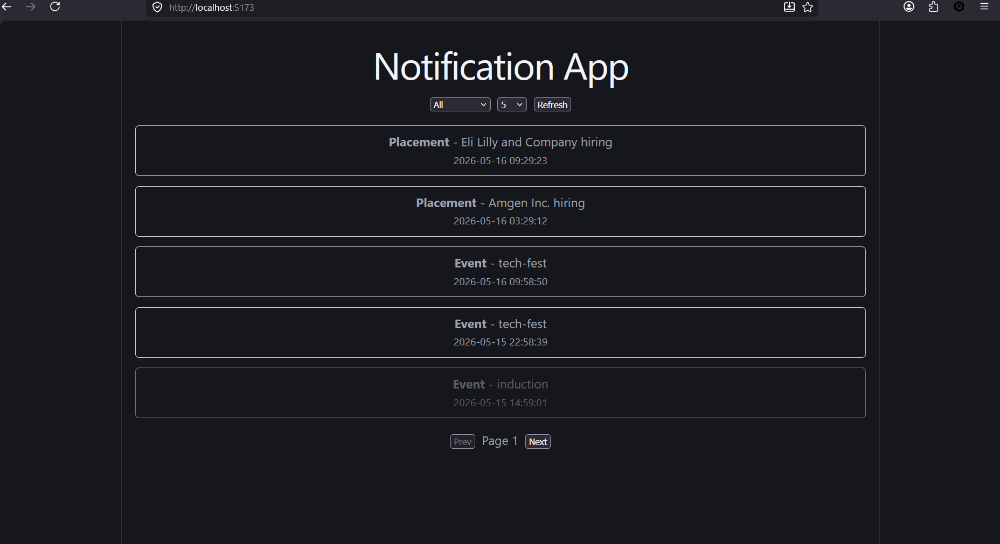
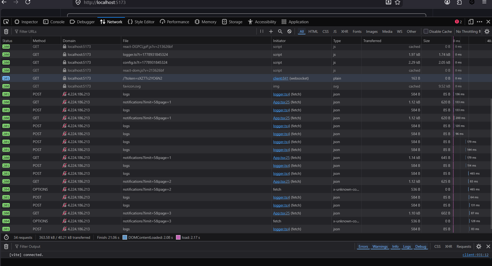
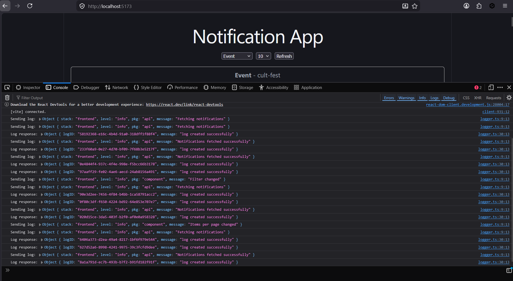

# Notification App — Frontend

A React + TypeScript frontend that fetches, filters, sorts, and paginates notifications from a protected REST API, with built-in logging middleware.

---

## Features

- Fetch notifications from a Bearer Token–protected API
- Priority-based sorting: **Placement → Result → Event**
- Timestamp-based sorting (latest first within same priority)
- Filter notifications by type
- Pagination via `limit` and `page` query parameters
- Read / Unread indication per notification
- Custom logging middleware for API calls, interactions, and errors

---

## Tech Stack

| Layer | Tool |
|---|---|
| Framework | React 18 (TypeScript) |
| Build Tool | Vite |
| Data Fetching | Fetch API |
| State Management | React Hooks (`useState`, `useEffect`) |
| Logging | Custom middleware (`utils/logger.ts`) |

---

## Project Structure

```
notification-app-frontend/
├── README.md
├── screenshots/
│   ├── ui.png
│   ├── network.png
│   └── logs.png
├── src/
│   ├── App.tsx
│   ├── types.ts
│   ├── config.ts
│   └── utils/
│       └── logger.ts
├── index.html
├── package.json
└── vite.config.ts
```

---

## Authentication

All API requests use a **Bearer Token** passed via the `Authorization` header:

```
Authorization: Bearer <YOUR_TOKEN>
```

The token is configured in `src/config.ts`.

---

## Run Locally

```bash
# Install dependencies
npm install

# Start development server
npm run dev
```

App runs at → **http://localhost:5173**

---

## Approach

### API Handling

Requests are made to a protected endpoint with query parameters:

| Parameter | Description |
|---|---|
| `limit` | Number of notifications per page |
| `page` | Current page number (1-indexed) |
| `notification_type` | Filter by type (`placement`, `result`, `event`) |

### Sorting Logic

Notifications are sorted in two passes:

1. **Priority sort** — `Placement` > `Result` > `Event`
2. **Timestamp sort** — Latest `created_at` first, within the same priority tier

### State Management

All state is managed via React Hooks:

- `notifications` — fetched data array
- `filter` — active notification type filter
- `page` / `limit` — pagination state
- `readIds` — set of notification IDs marked as read

### Logging Middleware

`utils/logger.ts` intercepts and logs:

- Outgoing API requests (URL, params, headers)
- API responses and errors
- User interactions (filter changes, page navigation, read toggles)
- State updates

---

## 📸 Screenshots

### 🔹 UI Preview


### 🔹 Network Logs


### 🔹 Console Logs


